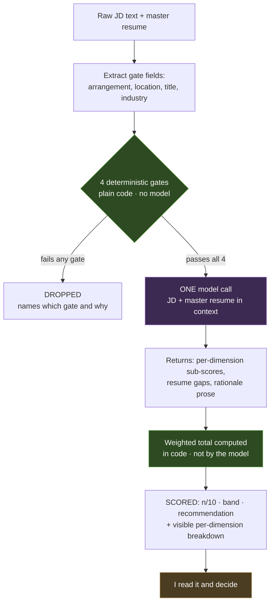

# Design Decisions — Job-Fit Scorer

[PRD.md](PRD.md) says *what* this does. This says *why it's shaped this way*.

One sentence up front, because everything below is a consequence of it:

> **A dealbreaker is a gate. A trade-off is a weight. The bug was averaging the two together.**

---

## 1. The problem, and why it's a design problem

I was scoring roles with a single weighted average over everything — location, salary, domain, seniority, all in one number. That produces **confident wrong answers**: a role in Vancouver that I can't take under any circumstances still scored 7/10, because strong domain and seniority fit pulled the average up over a constraint that should have ended the conversation.

The failure wasn't bad weights. Retuning them wouldn't have fixed it. The failure was **using one operation for two different kinds of criteria** — a viability question ("is this role possible for me at all?") and a desirability question ("how good is it?") got collapsed into the same arithmetic. Averaging is the right operation for the second and a category error for the first.

That distinction is the entire product. The app is one idea made literal.

---

## 2. System design

Every step is tagged with who executes it — `[CODE]` deterministic, `[MODEL]` probabilistic, `[HUMAN]` me. The tags are the point of the diagram: you should be able to see the trust boundary without reading a word of prose.

```
  INPUT
     raw JD text ....................... pasted in
     master resume ..................... read from local file (gitignored)
        │
        ▼
  [CODE]   EXTRACT gate-relevant fields
           arrangement · location · title · industry
        │
        ▼
  [CODE]   THE GATE — four binary checks
           runs before any API call · no model · no spend
              1. work arrangement / location
              2. country eligibility
              3. seniority floor (Senior PM and above)
              4. domain / title legitimacy
        │
        ├───────────── fails any one ─────────────┐
        │                                         ▼
        │                                  ✗  DROPPED
        │                                     names which gate and why
        │                                     never scored · no API call
        │
        ▼  passes all four
  [MODEL]  ONE scoring call — JD + master resume in the same context
           returns ▸ per-dimension sub-scores
                   ▸ resume gap list
                   ▸ rationale prose
        │
        ▼
  [CODE]   WEIGHTED TOTAL  =  Σ (sub-score × weight)
           ▲ the model never computes this number
        │
        ▼
  [CODE]   ✓  SCORED — n/10 · band · recommendation
              + per-dimension breakdown, shown not hidden
        │
        ▼
  [HUMAN]  I read it and make the apply / don't-apply call
```

<details>
<summary>Same diagram as Mermaid (renders on GitHub)</summary>



Green = deterministic code · Purple = the model · Amber = me.

</details>

**There are two deterministic boundaries here, not one.** The gate is the obvious one. The second is easy to miss and just as deliberate: the model returns *sub-scores per dimension*, and **code multiplies them by the weights and sums them**. The model never produces the final number. It contributes judgment on each dimension; the arithmetic that combines those judgments stays inspectable, reproducible, and mine.

That matters because the original bug lived in the combination step, not the individual assessments. Handing the combination back to a model would put the bug back where it started, just harder to see.

---

## 3. Why AI here at all — and what kind

The naive build is "send the JD to an LLM, get a score." That reproduces the exact bug: an LLM doing undifferentiated judgment over dealbreakers *and* preferences will smooth a hard no into a soft maybe, because that's what fluent judgment does.

So the question was never "AI or not." It was **AI where**.

| Layer | Where it shows up | Why it's that and not something else |
|---|---|---|
| **Pure automation** | The 4 gates: location/arrangement, country eligibility, seniority floor, domain-and-title legitimacy. Plain conditionals. No API call. | These are binary and knowable. A model here would buy a probabilistic answer to a question with a deterministic one — paying money for the *chance* of being wrong. |
| **Extraction** *(thin model use, or heuristics)* | Turning prose JD text into the structured fields the gates need. | The one place model output touches the gate path — kept deliberately narrow. It answers "what does this JD say the location is," never "is that location acceptable." Finding a fact, not judging it. |
| **Single-shot in-context AI** | The scoring call: JD + master resume → per-dimension sub-scores, resume gaps, rationale. | Real judgment, and genuinely subjective — "how well does 12 years of B2B SaaS PM work map to this JD's asks" has no lookup-table answer. This is where a model beats a formula. |
| **Not RAG** | No retrieval, no vector store, no corpus. | One resume, one JD — both fit in context. Retrieval solves "too much source material to fit," which is not a problem I have. Adding it would be infrastructure in search of a justification. |
| **Not agentic** | One call, one turn. No tools, no loop, no self-directed steps. | Agentic means the model chooses what to do next. Here the sequence is fixed and I designed it: gate, score, show me. Nothing needs to be decided at runtime about *what happens*. Calling this agentic would be inflating the architecture. |
| **Human-in-the-loop** | I read every output and make the apply/don't-apply call. | The scorer ranks and narrows. It never applies, never sends, never acts. The human step isn't ceremony — at this scale it's the primary safety mechanism (§7). |

The honest version of the "what kind of AI" answer includes the negatives. **Two of the six rows are deliberate absences**, and naming them is the point: RAG and agentic scope were considered and rejected on the merits, not skipped for lack of time.

### Where those layers *would* appear in later phases

Rejecting RAG and agentic scope for this slice is only a credible decision if I can say what would actually justify them. The test I'm using isn't what a feature does — it's **who controls the sequence**:

| | What it is | Who decides the steps |
|---|---|---|
| **Automation** | Fixed rules, no model | Me, at write time |
| **Generation** | Model produces output, one shot | Me — I wrote the prompt |
| **RAG** | Generation grounded on retrieved source material | Me — retrieve, then generate, fixed order |
| **Tool use** | Model can call functions to fetch or act | Shared — I define the tools, model picks |
| **Agentic** | Model chooses what to do next, when to stop, whether to retry | **The model, at runtime** |

Agentic isn't a measure of sophistication. A complex single-call feature is still not agentic; a simple loop where the model picks the steps is. The line is control flow, not capability.

Applying that to the two things most obviously missing from this slice:

**Company research (PRD §8) is retrieval — but "RAG" only under one of two implementations.** If I pre-build a company database and retrieve the matching profile at scoring time, that's RAG in the strict sense: a corpus I own, a fixed retrieve-then-generate order. If instead it's live web search at request time — model writes a query, reads results, judges whether it got enough, searches again — that's **tool use already leaning agentic**, because sufficiency is a runtime model decision. The two get called the same thing casually and they are not the same architecture.

**The better RAG candidate is the resume variant library, not company research.** Roughly 18 tailored variants is a corpus I own that will eventually exceed what's sensible to hold in context, and selecting the right base variant to ground tailoring on is retrieval in the textbook sense. That's the point where RAG stops being infrastructure-in-search-of-a-justification (§3) and starts solving the problem it exists for.

**Resume generation is not agentic by default, and I'd resist calling it that.** "JD + resume in, tailored bullets out" is one call — architecturally the same shape as the scoring call this slice already makes. It becomes agentic only if built as a model-driven loop: pick a base variant, draft, critique its own output against the JD, check keyword coverage, revise, write the file. **Self-evaluation and iteration make it agentic; producing a document does not.**

**The real agentic candidate is orchestration, not any single feature.** Monitor job boards → gate → score → decide which high-scorers justify the expensive downstream work → research those companies → tailor for the survivors → surface for review. A system allocating its own effort at runtime is an agent. Any one of those steps in isolation still isn't.

And that lands back on §4: the gate decides *whether*, an orchestrator would decide *what next*. Both are trigger-layer decisions, both need a trust mechanism distinct from the step-layer work underneath them — which is precisely why adding an agentic layer later would raise the stakes on the deterministic gate rather than reduce them.

---

## 4. Where it stays deterministic, and why that's the interesting part

The rule I applied:

> Anything **binary and knowable from the JD** is a gate — code, before any API call.
> Anything that's a **matter of degree** is a weight — model, on survivors only.

Salary is the clarifying case. I care about salary. It's a real preference with a real floor. But it is *deliberately weighted Low*, and it is emphatically **not a gate** — because a below-floor number is a negotiation, not an impossibility, and the moment I let it gate I'd be repeating the original error in the opposite direction. Meanwhile location *is* a gate, despite being the thing I'd most like to be flexible about, because no amount of role quality makes a Vancouver office reachable from Whitby.

**Strength of feeling doesn't determine gate-vs-weight. Structure does.**

### The connection to how I think about agentic CI

This maps onto the position I hold at work: **agents-as-triggers need a different trust mechanism than agents-as-steps.**

A model deciding *whether a process should run at all* is a categorically different trust problem than a model doing work *inside* a process that's already been authorized. The first is a gate decision; the second is a step decision. Collapsing them is how you get a system that's confidently, fluently wrong about something it should never have been asked to judge.

In CI: an agent shouldn't autonomously decide a risky test suite can be skipped. In this scorer: the model shouldn't decide a Vancouver-onsite role is close enough. Same structure, and the fix is the same — put a deterministic guardrail on the trigger decision, and let the probabilistic layer own the step work where its judgment is actually additive.

I built this partly because I wanted the argument to exist as code I can point at rather than a claim I make in an interview.

---

## 5. How I'd evaluate output quality

Splitting the pipeline into layers means each layer gets its own quality bar. "It runs" is not a metric.

### Gate layer — precision and recall, measurable by hand

The gate logic can't be wrong given correct inputs. The error surface is **extraction** feeding it bad fields — reading "hybrid, flexible" as fully remote, missing that "Toronto" meant the head office of a US-onsite role.

That's measurable without any ML infrastructure. Take ~30 JDs, hand-label each viable/non-viable, run the gate:

- **Drop precision** — of the roles the gate dropped, what fraction were genuinely non-viable? Low precision means it's silently eating good roles.
- **Drop recall** — of the genuinely non-viable roles, what fraction did it catch? Low recall means noise reaching the model, which at current volume is just wasted cents.

**The costs are asymmetric, and the asymmetry sets the design:**

| Error | What it costs | Recoverable? |
|---|---|---|
| **False drop** (viable role gated out) | A missed opportunity I will never know existed | **No** — silent and invisible |
| **False pass** (non-viable role scored) | ~1 API call and 10 seconds of my reading time | Yes — I catch it instantly |

Because a false drop is unrecoverable and a false pass is trivial, **ambiguity in extraction should resolve toward passing, not dropping.** When the JD is unclear about location, let it through to scoring and let me see it. A gate that fails toward "show the human" is the right failure mode for a system whose expensive error is silence.

That asymmetry is a design input, not just an observation — it's why the gate is tuned conservatively rather than aggressively.

### Scoring layer — calibration, not accuracy

There's no ground truth for "correct fit score," so accuracy is the wrong frame. Two things I *can* measure:

**Calibration drift.** Score a batch, write my own independent gut read on each before looking, compare bands. Occasional one-band disagreement is noise. *Systematic* disagreement in one direction is signal — the weights are miscalibrated, and I retune them rather than blaming the model.

**Groundedness of rationale and gaps** — the one that actually matters. Every claim in the rationale, and every item in the resume-gap list, must trace to specific text in the JD or the resume. The check is mechanical: sample N outputs, walk each claim, mark it supported or unsupported, track the unsupported rate over prompt changes.

A **hallucinated gap is worse than a missed one.** "Your resume doesn't show platform experience" when it plainly does isn't merely unhelpful — it actively pushes me away from a role I should apply to, with an authoritative-sounding reason. Fabricated evidence against myself is the highest-cost failure this system can produce, which is why it gets the most explicit eval.

### The scoring-layer asymmetry flips at scale

Right now, a mis-scored role costs almost nothing — I read every output, and a Strong that should've been Stretch just wastes one application. That tolerance exists **only because a human reads 100% of results.** The moment volume outgrows that (§9), scoring errors become silent too, and this section needs real infrastructure rather than hand-sampling.

---

## 6. Trade-offs

- **Speed over thoroughness, deliberately.** One model call keeps the loop near-instant. Holistic resume-fit with a short gap list beat bullet-by-bullet gap mapping — the latter needs a much longer prompt or multiple calls, for detail that doesn't change the apply/don't-apply decision. Fast enough to actually use on every posting beats thorough enough that I skip it.
- **Cost, made visible on purpose.** Per-run token count and estimated cost get logged and shown. The dimension weights are inspectable in the output; the cost of producing them should be too. Trivial to add now, and it's the only way cost stays a real axis rather than a thing I'd discover in a bill later.
- **Scope cut to protect rebuildability.** Everything in PRD §8 — company research, resume tailoring, live title verification — is a genuine value-add, cut because each drags in a dependency (live web, the variant library) that breaks "rebuildable from scratch in ~45 minutes with no external deps." That property is worth more to me than the features, because a system I can rebuild is one I actually understand.
- **One master resume, not the variant library.** Accepts a conservative, generic read of resume fit in exchange for zero setup per run. The tailored-variant version is strictly better output and strictly worse as a thing to maintain and demo.

---

## 7. Safety, privacy, ethics

- **Advisory only.** It ranks; it never acts. No application is ever submitted, no message sent, no external system touched. The human decision step is the safety mechanism, not a formality.
- **Personal data does leave the machine, and that's stated rather than glossed.** Every scoring call sends my resume — name, employers, contact details — plus the JD to a third-party model API. That's an accepted trade-off for a personal tool, made explicit so it's a decision rather than an accident. Consequences: the resume file is `.gitignore`'d from commit #1 alongside `.env` (PRD §10), and nothing logs request/response bodies to disk.
- **A public repo about my own job hunt is a disclosure.** The gates encode where I live and what I'll take; the scoring encodes what I want. That's fine — it's my information and I'm choosing to publish the *logic*. But the actual resume and any real scored postings stay local. The repo ships fixtures, not my genuine pipeline.
- **Deferred, not solved:** scraping (ToS questions), ATS interaction, storing third-party job data. Each carries a consent question this slice doesn't have to answer because it doesn't do any of them.

---

## 8. Known limitations

- **Extraction is the weak link.** Ambiguous JD language can misfeed the gate, and there's no live-posting verification to catch a stale or mislabeled title. The conservative failure mode (§5) mitigates but doesn't eliminate this.
- **No ground truth exists.** Zero outcome data (applied → screened → interviewed → offer), so scoring quality is calibration-checked against my own judgment — which is exactly the judgment the tool is meant to improve on. Circular, and I know it.
- **Weights are hand-set from introspection**, not fitted to anything. They encode what I *believe* I want, which is not necessarily what my actual accept/reject behavior would reveal.
- **Resume fit is measured against a generic master resume**, so it systematically *understates* fit for roles I'd tailor toward.
- **n=1.** One user, one set of preferences, hand-picked fixtures. Nothing here has met an adversarial or noisy input distribution.
- **The gate encodes today's constraints as permanent.** If I'd relocate for an exceptional role, the location gate is wrong and would drop it silently. That's the accepted cost of gating — it's decisive by design, which means when the premise changes the gate must change with it, and nothing in the system will warn me.

---

## 9. What changes at scale

Recording this because the laptop-sized scope is a choice, and the difference between a scoped MVP and an unfinished one is whether you can say what the next version needs.

| Dimension | Now | At scale | Why it changes |
|---|---|---|---|
| **Input volume** | One JD, pasted by hand | Automated scraped feed | This is why seniority and domain became *gates* rather than weights. Today I'm the first filter, so they'd never fire — at feed volume the gate layer is the only thing between raw noise and the model, and it has to be load-bearing before the volume arrives, not after. |
| **Configuration** | Thresholds hardcoded | Gates as config; salary possibly promoted to a gate | The deterministic/probabilistic boundary stays in the same place — what changes is that *moving* it becomes a user action instead of a code edit. |
| **Resume** | One master resume in context | Variant-aware matching, retrieval once the library is large | Re-introduces the tailoring scope cut in PRD §8. This is where RAG finally earns its place — when source material genuinely exceeds context (§3). |
| **Control flow** | Fixed pipeline I wrote: gate → score → show me | Orchestration that allocates its own effort across scraped volume | The point where this stops being a pipeline and becomes an agent (§3) — and where the gate's job gets harder, not easier, because no human is reviewing each result. |
| **Evaluation** | Hand-sampled calibration | Outcome tracking closes the loop | Persisting applied/interviewed/offer converts §5's proxy metrics into real precision/recall against decisions that actually mattered. Biggest single upgrade available. |
| **Cost** | Cents; logged out of discipline | A real constraint | Prompt caching on the repeated resume context, batching, rate limits, retries. Nothing exotic — but it becomes engineering rather than a line in a log. |
| **Trust model** | Gate is trusted because I wrote it and read every result | Gate must be auditable on its own | The one that actually matters. Today a human reviews 100% of outputs, so the gate's correctness is continuously spot-checked for free. Remove that and the deterministic boundary has to hold *unattended* — which is the whole agents-as-triggers problem again, one level up. |

---

## 10. Why this is the minimum lovable product

Not the minimum *viable* — minimum **lovable**, in that I'd actually use it, and it does one thing completely instead of five things partially.

It earns that on three counts:

1. **It solves the real failure.** Not a demo of scoring — a structural fix to the specific bug that produced confident wrong answers.
2. **It's honest about its own boundaries.** The deterministic layer, the probabilistic layer, and the human are separated on purpose, and the output shows the seams: which gate dropped a role, what each dimension scored, how the total was computed.
3. **I can rebuild it from nothing in about 45 minutes**, which is the real test of whether I understand it or just finished it.

Everything cut from this slice was cut because including it would have weakened one of those three.
